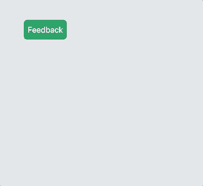

# SerVoice React Feedback Widget

A react wrapper for the [SerVoice](https://servoice.io) feedback widget. Easily collect and organize feedback from your visitors and users.

Need an account? Sign up [here](https://servoice.io).



## Installation

npm

```bash
npm i react-feedback-widget
```

## Usage

### Import the component:

```js
import { ServoiceFeedback } from 'react-feedback-widget';
```

### Set your config:

```js
const config = {
  servId: '1111111',
  servPID: 'kjh34kl2jh4kj234',
  userEmail: 'test@feedbackisgreat.com',
  userFirstName: 'David',
  userLastName: 'Groechel',
};
```

| Key           | Value                                  | Type   | Required |
| ------------- | -------------------------------------- | ------ | -------- |
| servId        | Your SerVoice portal Id                | String | Yes      |
| servPID       | The SerVoice project Id                | String | Yes      |
| userEmail     | The identified user in your app        | String | Optional |
| userFirstName | The first name of the identitfied user | String | Optional |
| userLastName  | The last name of the identified user   | String | Optional |

&nbsp;

### Wrap your component

```js
<ServoiceFeedback config={config}>
  <button type="button">Feedback?</button>
</ServoiceFeedback>
```

&nbsp;

> Note: There can only be one child element and it must emit a click event

&nbsp;

## Full Example

```js
import { ServoiceFeedback } from 'react-feedback-widget';

function App() {
  const config = {
    servId: '1111111',
    servPID: 'kjh34kl2jh4kj234',
    userEmail: 'test@feedbackisgreat.com',
    userFirstName: 'David',
    userLastName: 'Groechel',
  };
  return (
    <div className="App">
      <ServoiceFeedback config={config}>
        <button type="button">Feedback</button>
      </ServoiceFeedback>
    </div>
  );
}

export default App;
```

[Code Sandbox Example](https://codesandbox.io/s/servoice-react-feedback-example-gy6dn?file=/src/App.js)

## About

This project is maintained by [David Groechel](https://dgroechel.com) and [SerVoice](https://servoice.io).
